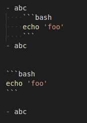

# Markdown Fenced Code Fix for VS Code

This extension fixes Markdown fenced code block syntax highlighting in lists via a hacky way.

- <https://github.com/Microsoft/vscode/issues/22185>
- <https://github.com/Microsoft/vscode/issues/10082>

# Requirements

- Require VS Code v1.14+.
